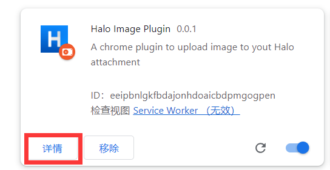
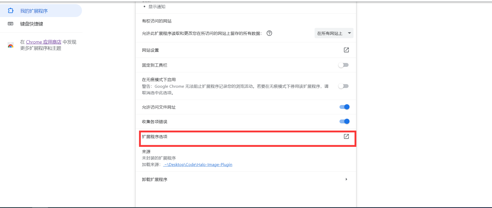

# 插件名称
Halo-image-plugin—— 一个浏览器插件，支持在浏览器中上传图片内容到Halo附件。

## 安装

### 通过开发者模式安装

1. 下载插件的 ZIP 文件并解压缩。
2. 打开 Chrome 浏览器，进入扩展程序页面（在地址栏输入 `chrome://extensions/`）。
3. 打开右上角的 "开发者模式"。
4. 点击 "加载已解压的扩展"，选择插件所在的文件夹。

## 使用说明
支持在浏览器中通过右键方式一键上传图片到Halo附件。

## 功能特点
- [x] 支持一键上传图片到Halo
- [x] 支持用户自定义设置图片命名规则
## 截图

1. 通过开发者模式安装此插件
2. 点击插件--> 详情
 
3. 点击 `扩展程序选项`

4. 进入halo个人中心，申请个人令牌，权限要求至少包含`附件管理`,填写完成其他信息,点击保存。

5. 在浏览器选择一个图片，右键，点击上传到我的Halo附件。完成！！
## 支持和反馈

如果你在使用插件时遇到问题或有建议，欢迎在 [GitHub Issues](https://github.com/GodlessLiu/Halo-Image-Plugin/issues) 中提出。

